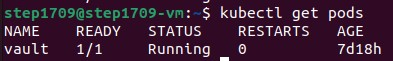
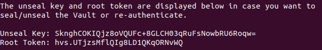
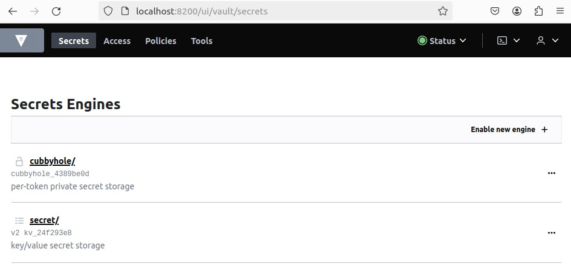
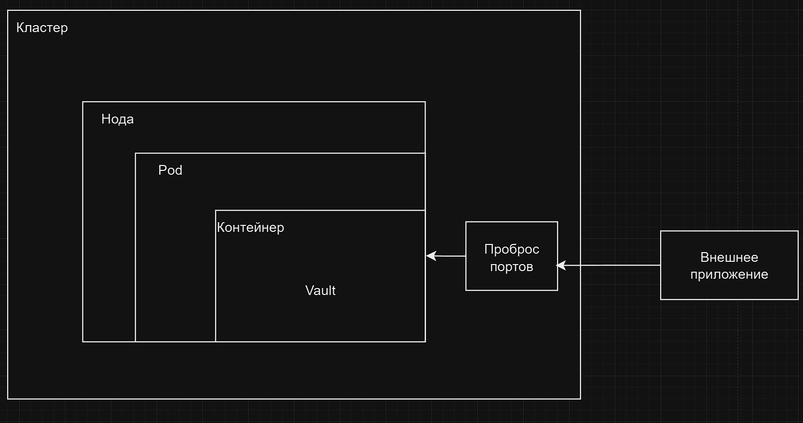

University: [ITMO University](https://itmo.ru/ru/)

Faculty: [FICT](https://fict.itmo.ru)

Course: [Introduction to distributed technologies](https://github.com/itmo-ict-faculty/introduction-to-distributed-technologies)

Year: 2024/2025

Group: K4111c

Author: Tikhonov Stepan Nikolaevich

Lab: Lab1

Date of create: 27.11.2024

Date of finished: 28.11.2024

---

## Лабораторная работа №1 "Установка Docker и Minikube, мой первый манифест."

### Описание
Первая лабораторная работа в которой вы сможете протестировать Docker, установить Minikube и развернуть свой первый Pod.

---

### Цель работы
Ознакомиться с инструментами Minikube и Docker, развернуть свой первый Pod.

---
### Ход работы

1. Так как работа выполняется на виртуалке, то в настройках ВМ включаем Nested VT-x/AMD-V

2. Установливаем `Docker` и `Minikube`

3. Запускаем minikube: `minikube start`

4. Создаем [yaml манифест](./vault.yaml) с настройками нашего Pod

5. Применим манифест: `kubectl apply -f vault.yaml`

6. Создадим сервис для доступа к контейнеру: `kubectl expose pod vault --type=NodePort --port=8200`

7. Прокинем порты: `kubectl port-forward service/vault 8200:8200`

8. С помощью `kubectl logs vault` найдем токен, который понадобится для авторизации

9. Теперь в браузере перейдем на `http://localhost:8200` и вставим токен

---

### Ответы

#### 1. Что сейчас произошло и что сделали команды указанные ранее?
`minikube start` - запуск кластера

`kubectl apply -f vault.yaml` - применение манифеста к кластеру

`kubectl expose pod vault --type=NodePort --port=8200` - создание сервиса

`kubectl port-forward service/vault 8200:8200` - проброс портов

`kubectl logs vault` - получение логов Pod

#### 2. Где взять токен для входа в Vault?
Токен можно получить, посмотрев логи: `kubectl logs vault`

---

### Схема организации контейнеров и сервисов

