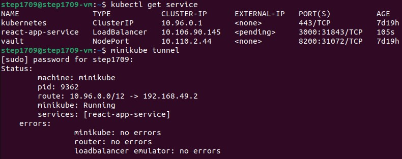

University: [ITMO University](https://itmo.ru/ru/)

Faculty: [FICT](https://fict.itmo.ru)

Course: [Introduction to distributed technologies](https://github.com/itmo-ict-faculty/introduction-to-distributed-technologies)

Year: 2024/2025

Group: K4111c

Author: Tikhonov Stepan Nikolaevich

Lab: Lab1

Date of create: 28.11.2024

Date of finished: 29.11.2024

---

## Лабораторная работа №2 "Развертывание веб сервиса в Minikube, доступ к веб интерфейсу сервиса. Мониторинг сервиса."

### Описание
В данной лабораторной работе вы познакомитесь с развертыванием полноценного веб сервиса с несколькими репликами.

---

### Цель работы
Ознакомиться с типами "контроллеров" развертывания контейнеров, сетевыми сервисами и развернуть свой веб сервис с ренпликами.

---
### Ход работы

1. Создаем [манифест деплоймента](./deployment.yaml) и применяем: `kubectl apply -f deployment.yaml`

2. Создаем [манифест сервиса](./service.yaml) и применяем: `kubectl apply -f service.yaml`.
 Будем использовать LoadBalancer для распределения нагрузки между Pod'ами.
 Затем используем `minikube tunnel` для получения `external-ip`:

3. Обратившись по адресу `<external-ip>:<port>` получаем необходимую страницу, при этом при
 открытии новой страницы мы попадаем на другой инстанс, где другой `ip` и `container-name`:

4. Логи Pod'ов:

---

### Схема организации контейнеров и сервисов

