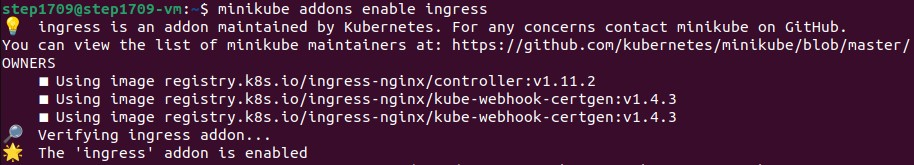
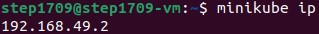
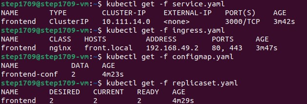
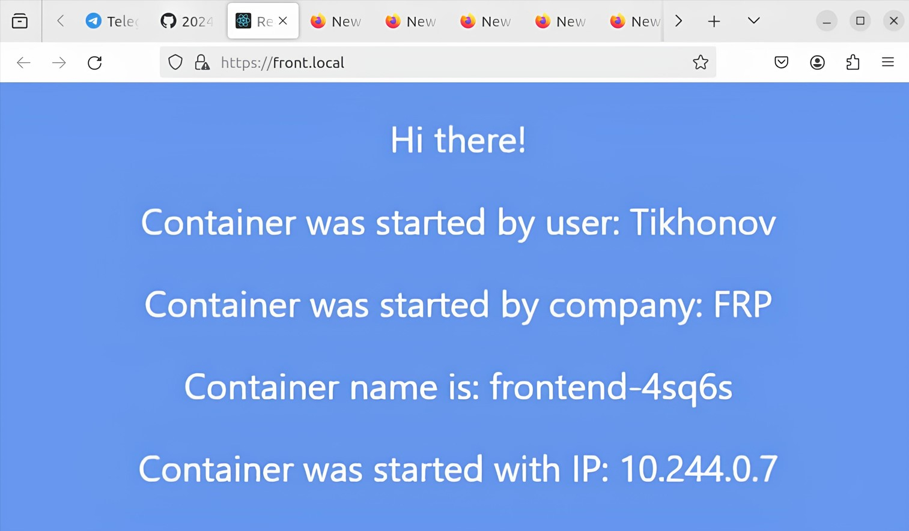
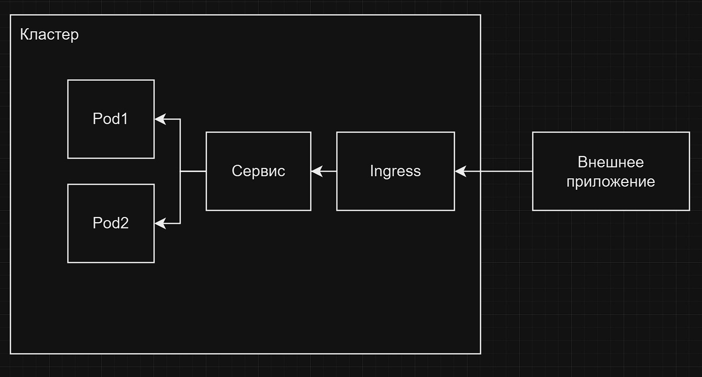

University: [ITMO University](https://itmo.ru/ru/)

Faculty: [FICT](https://fict.itmo.ru)

Course: [Introduction to distributed technologies](https://github.com/itmo-ict-faculty/introduction-to-distributed-technologies)

Year: 2024/2025

Group: K4111c

Author: Tikhonov Stepan Nikolaevich

Lab: Lab3

Date of create: 30.11.2024

Date of finished: 30.11.2024

---

## Лабораторная работа №3 "Сертификаты и "секреты" в Minikube, безопасное хранение данных."

### Описание
В данной лабораторной работе вы познакомитесь с сертификатами и "секретами" в Minikube, правилами безопасного хранения данных в Minikube.

---

### Цель работы
Познакомиться с сертификатами и "секретами" в Minikube, правилами безопасного хранения данных в Minikube.

---
### Ход работы

1. Создаем [configMap](./configmap.yaml) для переменных окружения и [replicaSet](./replicaset.yaml) для создания реплик.

2. Включим аддон minikube: `minikube addons enable ingress`

3. Создадим и заимпортируем TLS сертификат:

`openssl req -x509 -nodes -days 30 -newkey rsa -keyout front.key -out front.crt -subj "/CN=front.local"`

`kubectl create secret tls frontend-crt --cert=front.crt --key=front.key`

4. Обновbм конфигурацию [service](./service.yaml) и создадим [ingress](./ingress.yaml) манифест, укажем в нем
`host` и `secret`:

5. Определим ip адресс: `minikube ip`

6. Добавим запись о новом хосте `192.168.49.2 front.local` с помощью: `sudo nano /etc/hosts`

7. Запустим все компоненты (они все в одной директории): `kubectl apply -f .`

8. Переходим по адрему `http://front.local/` где видно, что используется https с сертификатом TLS

---

### Схема организации контейнеров и сервисов

