University: [ITMO University](https://itmo.ru/ru/)

Faculty: [FICT](https://fict.itmo.ru)

Course: [Introduction to distributed technologies](https://github.com/itmo-ict-faculty/introduction-to-distributed-technologies)

Year: 2024/2025

Group: K4111c

Author: Tikhonov Stepan Nikolaevich

Lab: Lab4

Date of create: 3.12.2024

Date of finished: 4.12.2024

---

## Лабораторная работа №4 "Сети связи в Minikube, CNI и CoreDNS"

## Цель работы: 

Познакомиться с CNI Calico и функцией IPAM Plugin, изучить особенности работы CNI и CoreDNS.

## Ход работы: 

При запуске minikube установим плагин CNI=calico и режим работы Multi-Node Clusters одновеременно:
`minikube start --nodes 2 --cni calico --kubernetes-version=v1.24.3`

Проверим количество нод: `minikube kubectl -- get nodes`

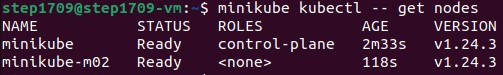

Проверим, что необходимые ресурсы созданы: `minikube status -p minikube`

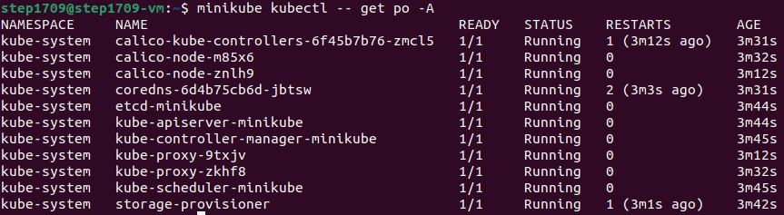

Установим [calicoctl](./calicoctl.yaml) pod, манифест взят с оф. сайта calico и немного изменен:

Применим манифест: `kubectl apply -f calicoctl.yaml`

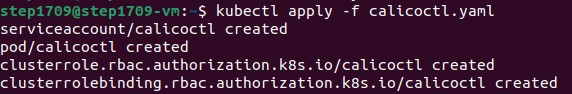

Укажем label по признаку географического расположения:

`kubectl label nodes minikube zone=north`

`kubectl label nodes minikube-m02 zone=south`

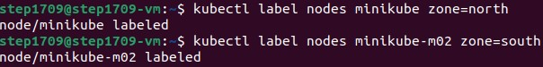

Создадим [ippool](./ippool.yaml), удалим пул по умолчанию:

`kubectl exec -i -n kube-system calicoctl -- /calicoctl create -f - < ip_pool.yaml --allow-version-mismatch`

`kubectl exec -i -n kube-system calicoctl -- /calicoctl  delete ippools default-ipv4-ippool --allow-version-mismatch`

`kubectl exec -i -n kube-system calicoctl -- /calicoctl  get ippools -o wide --allow-version-mismatch`

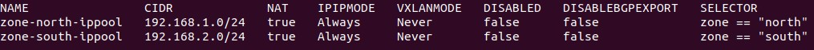

Создадим [resorces](./resorces.yaml): сервис, config map с требуемыми переменными, а также replicaset в одном файле.

Применим манифест: `kubectl apply -f resorces.yaml`

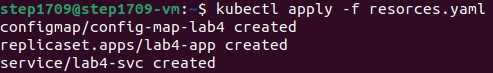

Дождемся запуска ресурсов: `minikube kubectl -- get po -A`

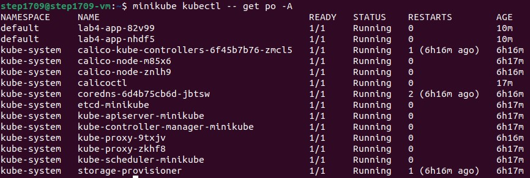

Пробросим порты: `kubectl port-forward service/lab4-svc 3000:8000`

Проверим работу в браузере:

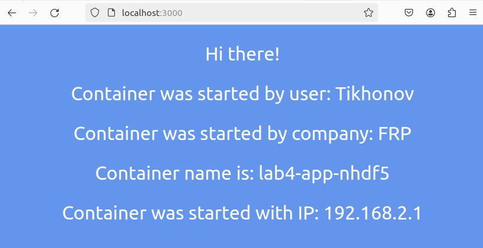

Узнаем ip: `kubectl get pods -o wide`

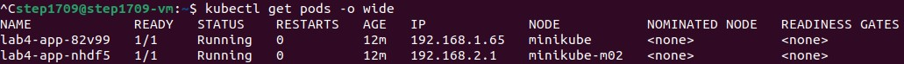

Проверим сетевую связность, используя ping: `kubectl exec -it lab4-app-82v99 -- ping 192.168.2.1`

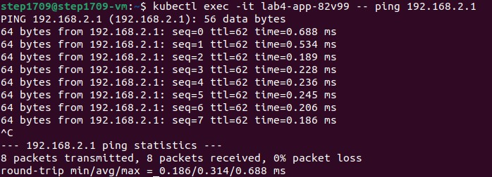

### Схема организации контейеров и сервисов

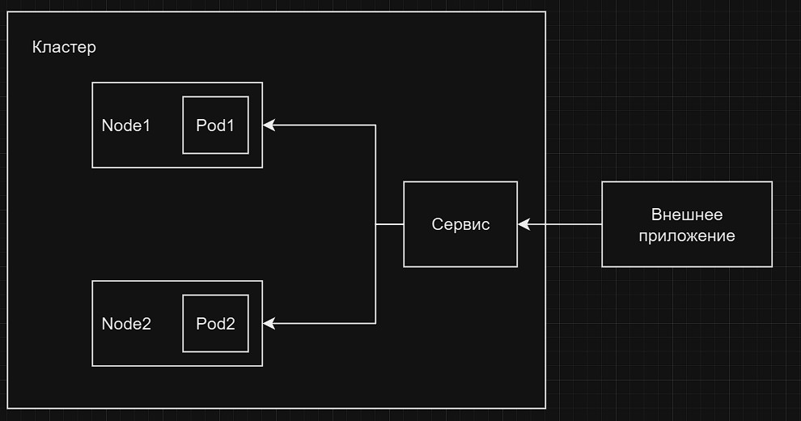

## Вывод:

В результате выполнения работы мы познакомились с CNI Calico и функцией IPAM Plugin, изучили особенности работы CNI и CoreDNS.